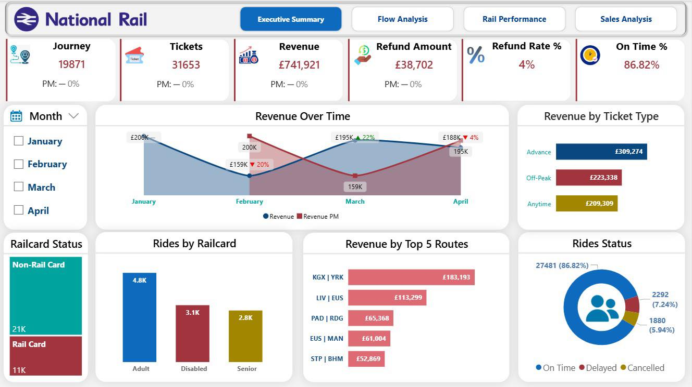
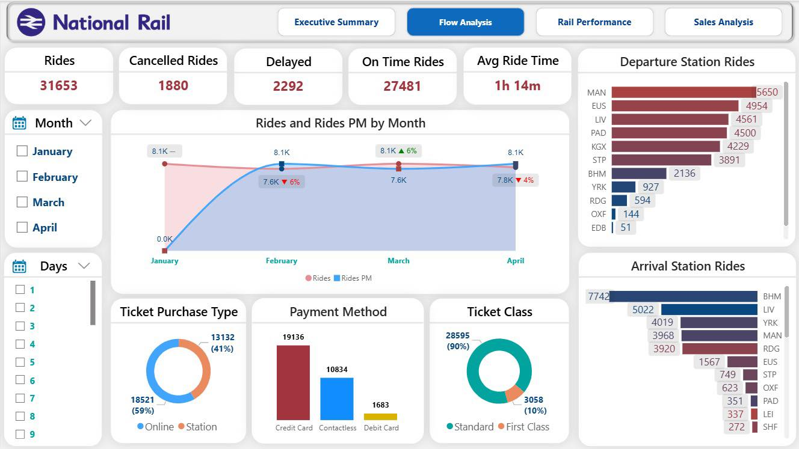
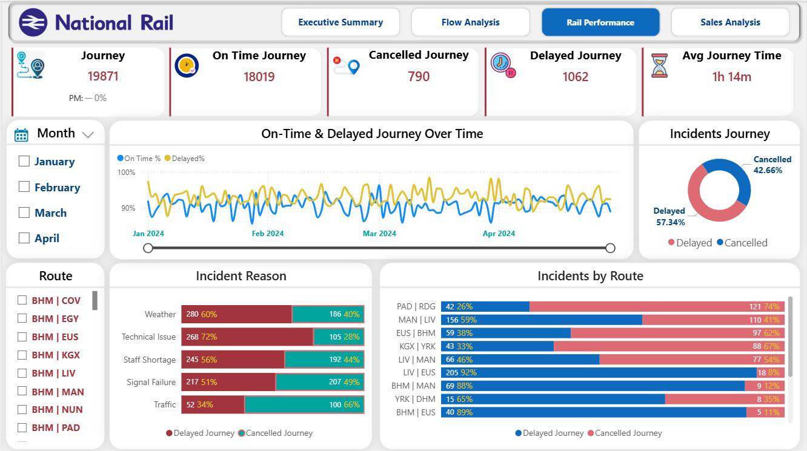
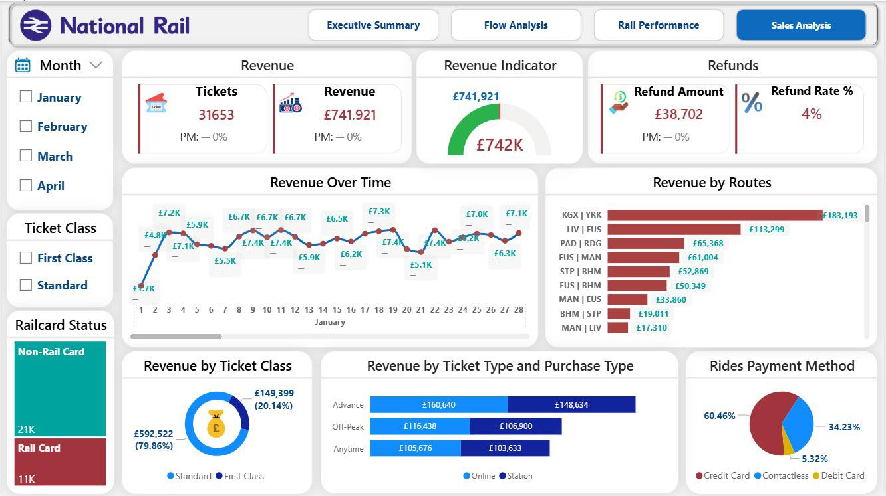

# UK-Railway-Analysis
End-to-end data analysis project using Power BI to optimize UK Railway operations, revenue, and passenger experience. (DEPI Graduation Project)
# 🚆 UK Railway Data Analysis - DEPI Graduation Project

## 📖 Overview
هذا المشروع هو ثمرة مجهود فريق العمل لمشروع تخرج مسار تحليل البيانات بمبادرة **رواد مصر الرقمية (DEPI)**. 
قمنا بتحليل بيانات السكك الحديدية في المملكة المتحدة (UK Railway) بهدف تحسين الكفاءة التشغيلية، فهم سلوك الركاب، وتعظيم الإيرادات باستخدام أدوات تحليل البيانات الحديثة.

---

## 📊 Dashboard Showcases (مخرجات المشروع)
*تم تصميم 4 لوحات بيانات تفاعلية لتغطية كافة جوانب العمل:*

### 1️⃣ الملخص التنفيذي (Executive Summary)
نظرة شاملة للإدارة العليا حول الأداء العام، إجمالي الإيرادات، وأهم مؤشرات الأداء (KPIs).

### 2️⃣ تحليل حركة الركاب (Flow Analysis)
دراسة أوقات الذروة، تحديد المحطات الأكثر ازدحاماً، وفهم أنماط رحلات الركاب.

### 3️⃣ أداء السكك الحديدية (Rail Performance)
تحليل دقيق للتأخيرات (Delays)، تحديد أسبابها، ومراقبة أداء الرحلات عبر المسارات المختلفة.

### 4️⃣ تحليل المبيعات (Sales Analysis)
تحليل مصادر الدخل، مقارنة أنواع التذاكر، وتحديد طرق الحجز الأكثر استخداماً.

---

## 🛠️ Tech Stack (الأدوات والتقنيات)
* **Power BI**: الأداة الرئيسية لبناء التقارير والنمذجة البصرية.
* **DAX (Advanced)**: لإنشاء المقاييس (Measures) المعقدة وتحليل البيانات الزمنية.
* **Power Query**: لتنظيف وتحويل البيانات الضخمة (ETL Process).
* **Data Modeling**: تطبيق نموذج **Star Schema** لضمان سرعة ودقة التقارير.

---

## 💡 Key Insights & Recommendations (أهم النتائج)
* **تحسين الإيرادات:** اقتراح استراتيجيات تسعير مرنة في أوقات الذروة.
* **الكفاءة التشغيلية:** تحديد المسارات التي تحتاج لصيانة وقائية لتقليل نسب التأخير.
* **تجربة العميل:** تحسين أنظمة الحجز الرقمي لتقليل الضغط على شبابيك التذاكر.

---

## 👥 فريق العمل (The Team)
تم إنجاز هذا العمل بتعاون الفريق المتميز:
* **شيرين طلعت سعد عبود* **ريمون عزت حبيب* ** بسمة عاطف عبدالغفور* ** مني محمد حسين**

---
**تحت إشراف:**م. كريم بقلي
**المبادرة:** رواد مصر الرقمية (Digital Egypt Pioneers Initiative).
**الموقع:** الأقصر، مصر 🇪🇬.
